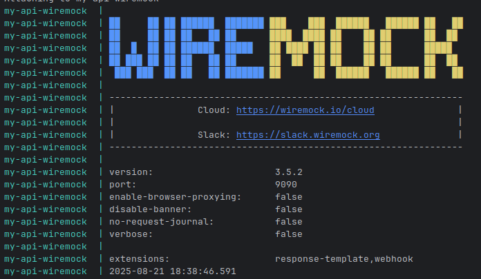
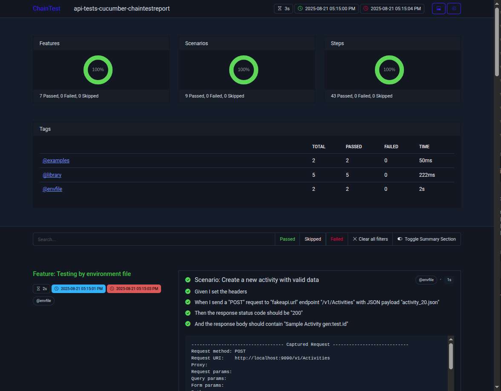

# example-using-ccb-lib-test

Example using the ccb-lib-test

Refs:

- Github: https://github.com/gerrysousa/ccb-lib-test
- Jitpack: https://jitpack.io/#gerrysousa/ccb-lib-test/0.0.1

### How to run the tests by command line

Run the following command to execute the tests:

```bash
mvn test
```

By default, the tests run in the `qa` environment, with base
url https://fakerestapi.azurewebsites.net/api.
To run in another environment, use the `-Denv` parameter.

For example, to run in the `build` environment:

```bash
mvn test -Denv=build
```

The `build` environment uses the base URL fakeapi.url=http://localhost:9090, which needs a local
Wiremock server.
Before running the tests in the `build` environment, ensure that you have started the Wiremock
server on port 9090.

### Wiremock server

To start the Wiremock server, You can run the Wiremock server in a Docker container using the
following command:

```bash
 docker compose -f docker-compose-component-tests.yml u
```

You will see the Wiremock server starting up and listening on port 9090.


To run the tests in the `build` environment, use the following command:

### REST options examples

```

Given I set the base URL to "https://fakerestapi.azurewebsites.net"

Given I set the endpoint to "/api/v1/Activities"

Given I set the request body with JSON file "payload.json"

Given I set the headers
| Content-Type | application/json |
| Accept | application/json |

Given I set the query params
| page | 1 |
| limit | 50 |

Given I set the form params
| username | john |
| password | 1234 |

Given I set the multiparts
| file | test.pdf |

When I send a "GET" request to "https://fakerestapi.azurewebsites.net" endpoint "/api/v1/Activities"

When I send a "GET" request to "https://fakerestapi.azurewebsites.net" endpoint "/api/v1/Activities"
with query params
| page | 1 |
| size | 10 |

When I send a "POST" request to "https://fakerestapi.azurewebsites.net" endpoint "
/api/v1/Activities" with form params
| username | john |
| password | 1234 |

When I send a "GET" request to "https://fakerestapi.azurewebsites.net" endpoint "/api/v1/Activities"
with headers
| Authorization | Bearer {token} |

When I send a "POST" request to "https://fakerestapi.azurewebsites.net" endpoint "/api/v1/upload"
with multiparts
| file | test.pdf |

When I send a "POST" request to "https://fakerestapi.azurewebsites.net" endpoint "
/api/v1/Activities" with JSON payload "payload.json"

When I send a "POST" request to "https://fakerestapi.azurewebsites.net" endpoint "
/api/v1/Activities" with JSON payload "payload.json" and query params
| page | 1 |
| size | 10 |

When I send a "GET" request to endpoint "/api/v1/Activities"

When I send a "POST" request to endpoint "/api/v1/Activities" with JSON payload "payload.json"

Then the response body should contain "Activity 1"

Then the response body should be equal JSON "expectedResponse.json"

Then the response status code should be 200

Then the response status code should be "404"

Then the JSON path "$.id" should be "123"

Then the JSON path "$.price" should be number 49.99

Then the JSON path "$.title" should exist

Then the JSON path "$.deprecatedField" should not exist

```

### Wiremock options examples

```

Given I reset the count of wiremock requests

Then the API mocks were called
| mock1 |
| mock2 |
| mock3 |

```

### Chaintestreport example



Here is an example of the Chaintestreport generated after running the tests:
[ChaintestReportExample.html](ChaintestReportExample.html)

In the resport, all REST requests and responses are displayed, including the request body, response
body, like the log below:

```log
---------------------------------- Captured Request ----------------------------
Request method:	POST
Request URI:	http://localhost:9090/v1/Activities
Proxy:			
Request params:	
Query params:	
Form params:	
Path params:	
Headers:		Accept=*/*
				Content-Type=application/json
Cookies:		
Multiparts:		
Body:
{
    "id": 20,
    "title": "Sample Activity 20250821171501074",
    "dueDate": "2025-08-21T17:15:01.074Z",
    "completed": false
}
HTTP/1.1 200 OK
Content-Type: application/json
Matched-Stub-Id: 86fed8fe-c46c-4335-952b-2d5e18425cec
Matched-Stub-Name: post-activities-001
Content-Encoding: gzip
Transfer-Encoding: chunked

{
    "id": 20,
    "title": "Wiremock Sample Activity 20250821171501074",
    "dueDate": "2025-08-21T17:15:01.074Z",
    "completed": false
}
--------------------------------------------------------------------------------
```

### Test Variables Generated

For each test scenario, some variables are generated and can be used in the requests, for example:

```log
+++++++++++++++++++ Test Variables Generated +++++++++++++++++
gen:id.epoch: 1756307686516
gen:test.id: 20250827121446516
gen:timestamp: 2025-08-27T12:14:46.516Z
gen:id.timestamp: 20250827121446516
gen:today.numeric: 20250827
gen:id.string: VAOd1nlgbP
gen:today.date: 2025-08-27
gen:id.uuid: 5254ca47-4c7a-4e33-8086-a63fa5a9f851
++++++++++++++++++++++++++++++++++++++++++++++++++++++++++++++
```

Example of using the generated variables in the request body:
In a JSON file named `activity_20.json`:

```json
{
  "id": 20,
  "title": "Sample Activity gen:test.id",
  "dueDate": "gen:timestamp",
  "completed": false
}
```

And in the feature file:

```feature
  Scenario: Create a new activity with valid data
    Given I set the headers
      | content-type | application/json |
    When I send a "POST" request to "fakeapi.url" endpoint "/v1/Activities" with JSON payload "activity_20.json"
    Then the response status code should be "200"
    And the response body should contain "Sample Activity gen:test.id"
```

Project structure:

```
/example-using-ccb-lib-test
├───src
│   └───test
│       ├───java
│       │   └───runners
│       │       └───RunCucumberTest.java
│       └───resources
│           ├───envs
│           │   ├───env-local.properties
│           │   └───env-qa.properties
│           ├───features
│           │   └───simple-example-test.feature
│           └───payloads
│               ├───activity_20.json
├───wiremock-mappings
│   └───fake-api
│       ├───get-activities-by-id-001.json
│       └───post-activities-001.json
├───docker-compose-component-tests.yml
├───pom.xml
└───README.md
```

Tags: @api @regression @wiremock @chaintestreport @maven @rest @java @cucumber @restassured